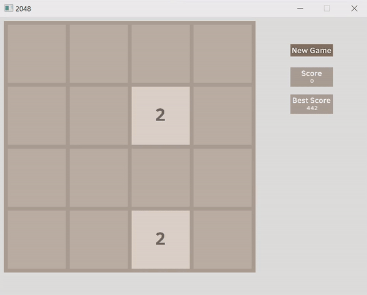

# OopFinalProject
C++ game 2048

Start Project Date: July 10, 2020

End Project Date: 
## Team
- **`19127463` Nguyễn Hoàng Long**
  - **Facebook:** [Hoang Long Nguyen](https://www.facebook.com/profile.php?id=100014108702108)
  - **Email:** <19127463@student.hcmus.edu.vn>

- **`19127012` Vũ Nguyễn Thái Bình**
  - **Facebook:** [Vũ Bình](https://www.facebook.com/vubinh.hcmus)
  - **Email:** binh161905@gmail.com

- **`19127564` Nguyễn Hữu Thông**
  - **Facebook:** [Thông Nguyễn](https://www.facebook.com/t.ahhahaha)
  - **Email:** <e-mail>
  
- **`19127507` Nguyễn Quang Phú**
  - **Facebook:** [Nguyễn Quang Phú](https://www.facebook.com/nqp2805)
  - **Email:** <e-mail>
## Project Planner
- [x] **Setup and using SFML lybrary**
- [x] **Core function**
- [x] **Update more option**
- [] **Make resourcepacks**
- [] **Load resourcepacks**
## How to play ?
Use your arrow keys to move the tiles. When two tiles with the same number touch, they merge into one!

